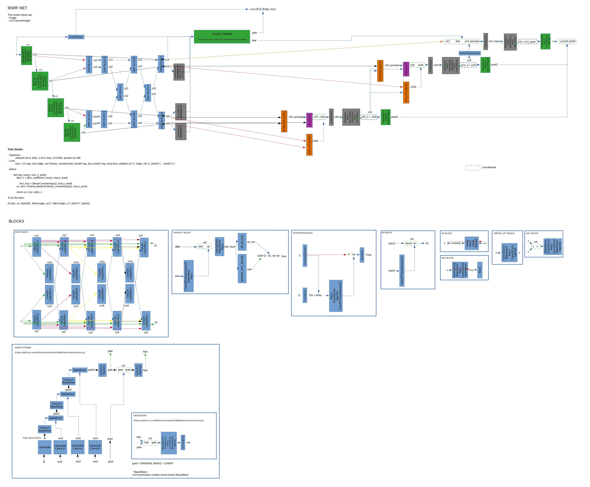

# MSRF-Net_PyTorch

Unofficial code of [MSRF-Net](https://arxiv.org/pdf/2105.07451.pdf) developed in PyTorch

`------------ IN PROGRESS ------------`

- [x] Write the model code based on [official TF code](https://github.com/NoviceMAn-prog/MSRF-Net).
- [x] Write the training/evaluation code.
- [x] Improve the training/evaluation code adding some stuff to tensorboard.
- [ ] Write the test/inferencing code.

## Implementation details

- PyTorch 1.8.1 was used with cuda 11.2.
- The hyperparameter init_feat was added. It controls the number of initial channels for the UNet. In the original code It was 32. I recommend to use a power of two  because the reduction ratio in [Squeeze and Excitation blocks](https://arxiv.org/abs/1709.01507).
- The Shape Stream isn't copy exactly from official code, It was copied from the [original Shape Stream repo.](https://github.com/leftthomas/GatedSCNN)
- Added image visualization during training to TensorBoard. This improvement will help you to check the performance during training.

## Model architecture

